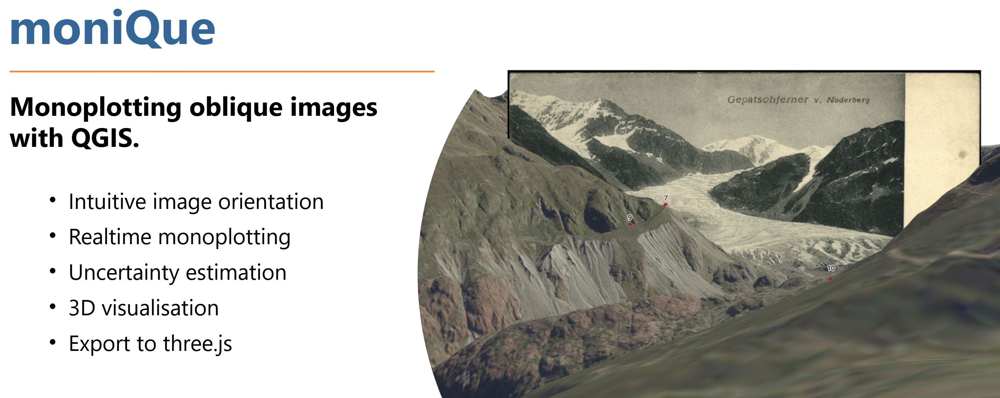

# Supported QGIS versions
We tested moniQue with the following QGIS versions:
| Version  | OS | Python |
| --- | --- | --- |
| 3.34.3 | Windows | Python 3.11
| 3.34.15 (LTR) | Windows | Python 3.12
| 3.34.40 | Windows | Python 3.12
| 3.40.5 (LTR) | Windows | Python 3.12

# Installation
### Required Python packages
Open the **OSGeo4W Shell** and install the required python packages using pip  

    pip install --user open3d pygfx==0.9.0 glfw lmfit

`open3d` is required for raycasting, `pygfx` and `glfw` for rendering the terrain in 3D, `lmfit` for the least squares spatial resection. Installation with the `--user` option is necessary as the default QGIS Python interpreter is located on ```C:\...``` which would require admin rights.  

> [!IMPORTANT]
> We recently switched to the newest version of pygfx which introduced some breaking changes. Hence, it might be necessary to upgrade pygfx!

### Plugin
<!-- After installing the additional Python packages, **moniQue** can be installed like any other QGIS plugin from `Plugins -> Manage plugins`. After the succesful installation you should see the logo in the QGIS main toolbar and a new entry in the `Plugin` menu is available. -->
> [!IMPORTANT]
> The provided version in the QGIS plugin repository is currently depreceated.
> Therefore it is recommended to use the current version of the plugin from 
> here. 

Click on ``Code`` and ``Download ZIP``. From the downloaded ZIP only the ``moniQue`` subdirectory is required. Create a new archive which only contains this directory. In QGIS go to `Plugins -> Mange and install plugins --> Install from ZIP` and select the newly created ZIP. 


# Dokumentation

1. [Example Workflow](#example-workflow)

    1.1 [Creating a moniQue project](#1-creating-a-monique-project)

    1.2 [Importing images into the project](#importing-images-into-the-project)

    1.3 [Setting Ground Control Points - GCP](#setting-ground-control-points-gcp)

    1.4 [Calculate orientation](#calculate-orientation)

    1.5 [Manually adjust camera position](#manually-adjust-camera-position-optional)

2. [Orientation Tool](#orientation-tools)

    2.1 [Open orientation dialog](#open-orientation-dialog)

    2.2 [Add new GCP](#add-new-gcp)

    2.3 [Edit GCP](#edit-gcp)

    2.4 [Delete GCP](#delete-gcp)

    2.5 [Import GCP](#import-gcp)

    2.6 [Set initial camera parameters](#set-initial-camera-parameters)

    2.7 [Calculate orientation](#calculate-orientation)

    2.8 [Save orientation](#save-orientation)

    2.9 [Project mouse cursor to image](#project-mouse-cursor-to-image)

    2.10 [Move camera along viewing direction](#move-camera-along-viewing-direction)

3. [Monoplotting Tool](#monoplotting-tools)

    3.1 [Activate monoplotting](#activate-monoplotting)

    3.2 [Select monoplotted lines](#select-monoplotted-lines)

    3.3 [Edit monoplotted lines](#edit-monoplotted-lines)

4. [Image canvas Tools](#image-controller-tools)

    4.1 [Pan image](#pan-image)

    4.2 [Zoom to image extent](#zoom-to-image-extent)

5. [Object canvas Tools](#object-controller-tools)

    5.1 [Reset to default camera position](#reset-to-default-camera-position)

    5.2 [Set camera to current QGIS extent](#set-camera-to-current-QGIS-extent)

    5.3 [Show image in 3D canvas](#show-image-in-3d-canvas)

    5.4 [Show camera in 3D canvas](#show-camera-in-3d-canvas)

    5.5 [Save camera position](#save-camera-position)

    5.6 [Set camera to saved position](#set-camera-to-saved-position)

6. [Keyboard Shortcuts](#keyboard-shortcuts)

---

# Example Workflow

moniQue requires a digital terrain model (DTM) as mesh in the PLY format. We recommened to use [monique-helper](https://github.com/smfloery/moniQue-helper) to generate the mesh tiles as well as orthophoto tiles used to texture the mesh. The following workflow will be demonstrated using examplary data, which were prepared with moniQue-helper and are provided on this GitHub repository in the folder [Pasterze_Demo]().

### Creating a moniQue-project
After starting up moniQue by clicking the  button in the QGIS user interface, go to `File` and select the option `Create from *.json` from the dropdown menu. In the newly opened Explorer window, navigate to the directory containing the meshes and orthophotos to be used for the project and select the `.json`-file. After some loading time the project (`.gpkg`-file) is created and the 3D-scene will be rendered on the right side of the moniQue window. To reopen an already existing project go to `File` and choose `Open`, then find the previously created `.gpkg`-file select it. 

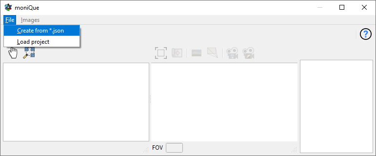

### Importing images into the project
With the project opened we can import some images to be oriented in further steps. To do so, click on `Image` and select `Import Image`, which will open an explorer tab once again. Navigate to the directory of the images you want to use, select all of them and finally click on `Open`. The names of the images must be unique and it is recommened that the names do not contain special characters (&,ä,ö,...) or white spaces. After importing the image names will appear in the table on the right hand side of the moniQue user interface. You can now select an image by checking the box next to its name in this table.

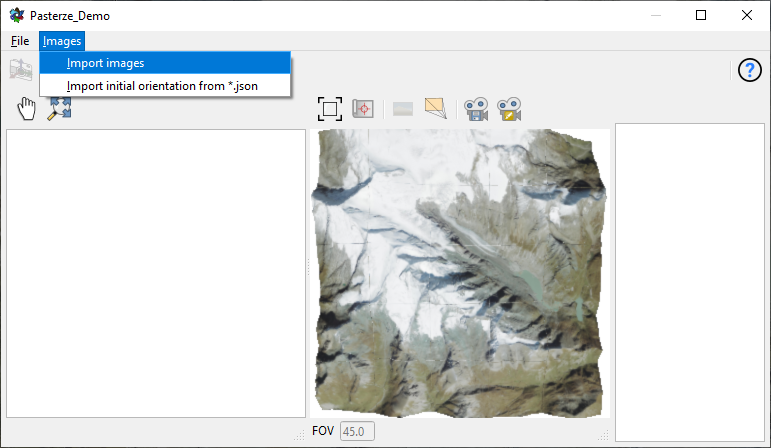

### Setting Ground Control Points (GCP)
After selecting an image you can start the orientation process by [opening the orientation dialog](#open-orientation-dialog) with the 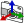 icon. As long as this dialog is opened, GCPs can be selected and edited. The unknown camera parameters (exterior and interior orientation) are calculated by spatial resection. As 7 parameters are assumed to be unknown (coordinates of the projection center, euler angles, focal length), at least 4 ground control points (GCPs) are required. Those points need to be identified and set in both the image and object space. Both in the images and 3D canvas a new GCP can be added by clicking `Ctrl + Left Mouse`. This will open a new dialog where the ID of the GCP can be set. The image and object coordinates of GCPs are linked by their ID. Hence, if an image GCP and object GCP have the same ID, they will be treated together as one GCP. 

It is recommended to align the camera view of the 3D canvas with the scene depicted in the image before setting the GCPs. Note that it is possible to [temporarily save](#save-camera-position) this view, enabling you to easily [return](#set-camera-to-saved-position) to it at any time.

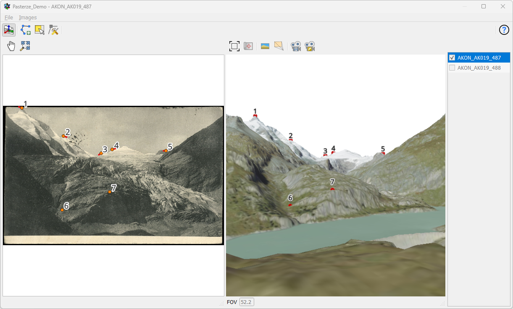

### Calculating orientation
Initial estimates for the unknown camera paramters are required for the calculation of the orientation. One of the advantadges of displaying the terrain in 3D is that the 3D viewer can be used for obtaining those values. Hence, first align the camera of the 3D viewer in such a way that it resembles the image. Subsequently, clicking on the  icon above the camera paramters will automatically extract the required values from the 3D view. 

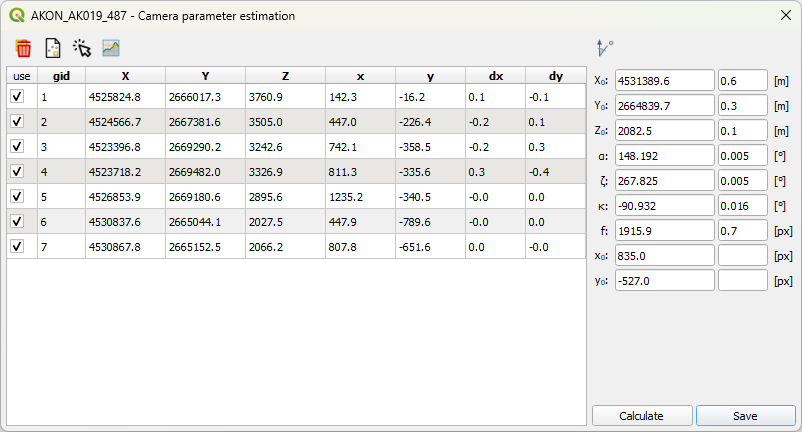

Now the spatial resection can be calcuted by clicking `Calculate`. If the calculation was successful, the 3D camera is automatically set to the calculated camera parameters. The image residuals can now be viewed in the GCP table as `dx` and `dy`. Those residuals are additionally visualized in the image canvas in form of red lines. Furthermore, the oriented image can be rendered in the 3D view to visually inspect the estimation result by clicking on the  icon. With the mouse wheel you can translate the historical image along the viewing direction. Within the spatial resection dialog one can see the estimated camera parameters, standard deviations and image residuals. As it is likely that the first set of GCPs chosen will not lead to an optimal result, it is recomended to improve the orientation by [editing](#edit-gcp) the GCPs to decrease the image residuals. After achieving a satisfying result the calculation can be saved by clicking on the `Save` button. By that, the estimated camera parameters and GCP configuration will be saved to the project file.

### Manually adjust camera position (optional)
In some cases, the estimated position of the camera will be below ground or behind a hill. This is mainly related to the simultaneous estimation of the coordinates of the projection center and the focal length. However, the estimated euler angles are quite accurate whereas only the position of the camera is displaced along the acquisition direction. Hence, to manually correct this one can mannually displace the camera along the acquisition direction. Open the "Displace camera along viewing direction" function by clicking the 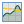 icon in the orientation dialog. This will open a line plot showing the profile of the terrain alogn the acqusition direction as well as the height of the camera. By selecting a new position within this plot the camera will be updated, to save this manually chosen position click the `Save` button. Note that pressing `Calculate` again will override the manually chosen position with the calculated one.

### Monoplotting
After the camera parameters have been estimated, we can now use monoplotting. By that, object coordinates of the image pixels are directly obtained by intersection the projection rays with the terrain. Thus, one can directly document features of interest in the image. To activate monoplotting click the icon next to the camera symbol in the main dialog. If you now move your mouse over the image canvas, moniQue automatically intersects the respective image rays with the terrain mesh. As a result you see the intersection point in the QGIS main canvas. By clicking the left mouse button vertices of a polyline are created and stored. You can finish a polyline by clicking the right mouse button.

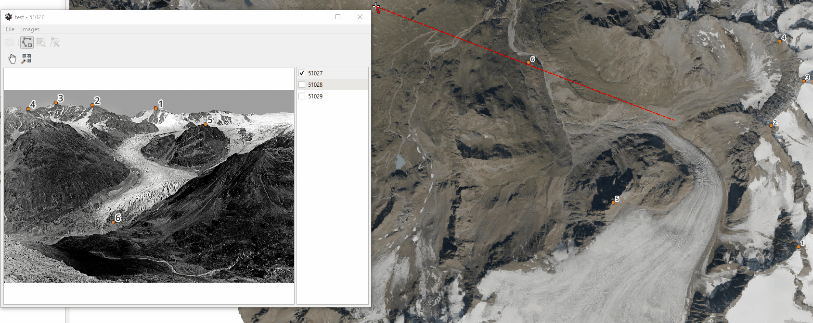

---

# Orientation Tool
The main application of moniQue, besides monoplotting, is the orientation of images—meaning the calculation of camera positions and viewing directions from the place of capture. These calculations are performed using a spatial resection based on corresponding points (GCPs = Ground Control Points) in both the image and the 3D canvas, which have to be picked manually. To enable image orientation, a number of tools and functionalities are provided in moniQue and described in the following documentation.

### Open orientation dialog
To open the orientation dialog and subsequently orient an image, click on the  icon. A new window showing the coordinates and residuals of already defined GCPs in a table will open. If no GCPs have been set yet, the table will be empty.

### Add new GCP
After opening the orientation dialog, the mouse cursor will be displayed as a crosshair when hovering over the image or 3D canvas inside the moniQue user interface. By holding down `Ctrl` and clicking on a position inside either canvas with the `left mouse button`, you can set a GCP at that location. A new window will open, asking you to assign an ID (GID) to the newly added point. Corresponding points in the image and 3D canvas must be labeled with the same ID, linking them to each other. One GCP consists of the coordinates in the image as well as the 3D space and must therefore be set in both to be used for calculations.

### Edit GCP
To edit an existing GCP, the point must be selected either by clicking on the corresponding entry in the orientation dialog table or by selecting it directly in the image or 3D canvas. For the latter, hold down `Alt` and click on the point in the respective canvas using the `left mouse button`. The selected point can now be moved to a new position in the same way as [adding a new point](#add-new-gcp).

### Delete GCP
To delete an existing GCP, the point must first be selected as described [above](#edit-gcp). Then press the  icon in the orientation dialog to delete the GCP.

### Import GCP
It is also possible to import already existing GCPs into your moniQue project. The points need to be provided as csv-file containing the point ID as well as image- and 3D-coordinates. 

### Set initial camera parameters
Before calculating the orientation of an image, it is necessary to set the initial camera parameters to be used in the calculations. Navigate to a position in the 3D canvas showing a scene that most closely resembles the one in your image. Then press the  icon in the top-right corner of the orientation dialog. The estimated initial camera parameters will appear in the table beneath the icon.

### Calculate orientation
To calculate the orientation of an image, a minimum of four corresponding GCP pairs in the image and 3D canvas is required. After setting the initial camera parameters, press `Calculate` to orient the image. The view in the 3D canvas will shift to the calculated position, and the residuals for the GCPs will be displayed in the orientation dialog. The correctness of the orientation can be evaluated by examining these residuals, either in the table or in the image canvas, where they are depicted as red lines indicating the direction in which the 3D point should be moved.

### Save orientation
 After calculating an orientation you may [edit](#edit-gcp) the points accordingly and press `Calculate` again to decrese the residuals. When you are satisfied with the accuracy of the results you can press `Save` to confirm the final orientation. The calculated orientation is now saved in the moniQue project and stays accessible after closing and reopening the project.

### Project mouse cursor to image
After saving the orientation of an image it is possible to project the mouse cursor from the 3D canvas to the image by toggeling the 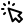 icon. This may help identify corresponding points and verify the correctness of your orientation.

### Move camera along viewing direction
Due to the focal lenght often being unknown, especially for old images, it has to be estimated. This may lead to a shift of the calculated orientation along the axis of the viewing direction, often resulting in the camera lying to far above or under the ground. It is possible to manually correct this, but keep in mind that it may increase the residuals of the already set GCPs. By pressing the  icon a new dialog window will open, showing the profile of the terrain along the viewing direction of the calculated camera. By clicking on a spot along the profile you move the camera position alsong its viewing direction. After the adaptation you need to press `Save` in the orientation dialog to confirm your changes.

---

# Monoplotting Tool
Monoplotting projects the viewing ray of a pixel from the oriented 2D image into the 3D model and intersects it with the terrain surface. This allows determining the corresponding 3D position for each point in the photograph.

### Activate monoplotting
To start or end the monoplotting process toggle the  icon. By clicking inside the image with the left mouse button you can now draw lines which are saved to the moniQue project (gpkg) and will also be shown in the canvas of the underlying QGIS project. To confirm and save a line you need to press the right mouse button. A new dialog window will open, where you can optionally add a description or comment. Pressing `Ok` in this window will close it and save the created line.

### Select monoplotted lines
You can select already plotted lines by toggeling the  icon. Hold down the left mouse button and drag to span open a rectangle. All lines inside will be selected. Selected lines can be deleted by pressing the `Delete` Button on your keyboard.

### Edit monoplotted lines
By toggeling the  icon you can start editing mode for the monoplotted lines. You can now move their points by clicking on them with the left mouse button.

---

## Image Controller Tool

### Pan image
Toggle the  icon to enable panning in the image canvas, by holding down the left mouse button and draging the image. Alternatively you can also hold down the middle mouse button and drag to pan the image at anytime.

### Zoom to image extent
By pressing the  icon you can center the image and zoom to its extent.

---

## Object Controller Tool

### Reset to default camera position
To reset to the default camera position, a top down view of the entire 3D model, you can press the 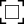 icon.

### Set camera to current QGIS extent
If searching for a specific location in the 3D canvas you can search it inside the underlying QGIS project. By pressing the 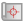 icon the camera will move to the approximate location showing the same scene as the current QGIS canvas.

### Show image in 3D canvas
After an image is oriented the  icon can be pressed to project the oriented image into to 3D canvas. By moving the mouse wheel up or down you can translate the image along the viewing direction.

### Show camera in 3D canvas
Toggle the 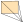 icon to show or hide the camera positions of the already oriented images in the 3D canvas. The camera position of the currently selected image is highlighted in red.

### Save camera position
After navigating to a certain position inside the 3D canvas it might be of use to save this view. To do so press the  icon - note that the position is only saved until the program is shut down. 

### Set camera to saved position
After saving a camera position you may return to that view at any time by pressing the  icon.

---

# Keyboard Shortcuts
| Key(s)  | Action | Canvas
| --- | --- | --- |
| Left Mouse (drag) | Rotate camera / Translate Image | 3D / Image
| Mouse wheel | Zoom | 3D & Image
| Right Mouse (drag) | Translate camera | 3D
| Strg + Left click | Add GCP | 3D & Image (during orientation)
| Strg + Right click | Zoom to position | 3D
| Strg + Mouse wheel | Adjust FOV | 3D
| ALG + Right click  | Go back to previous position | 3D
| A W S D | Move camera in object space | 3D
| &uarr;  &darr;  &larr;  &rarr; | Rotate camera in object space | 3D
| Q E | Tilt camera | 3D
| F1 | Store current camera as .json | 3D

---

## Funding
moniQue was developed within the SEHAG project which was funded by the DFG (Deutsche Forschungsgemeinschaft) under the grant [FOR 2793](https://gepris.dfg.de/gepris/projekt/394200609) and FWF (Österreichischer Wissenschaftsfond) under the grant [I 4062](https://www.fwf.ac.at/forschungsradar/10.55776/I4062). 

## Contact
Sebastian Mikolka-Flöry (sebastian.floery@geo.tuwien.ac.at)
